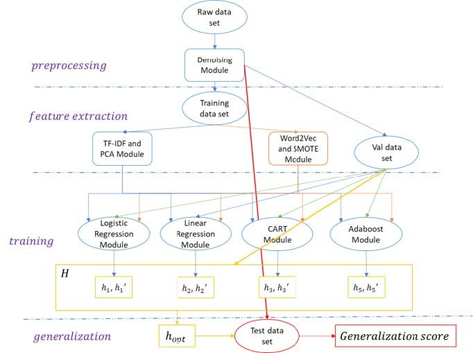

# Amazon Review Sentiment Analysis
> This project is to build a natural language processing system fitting the relation between Amazon review text and the coresponding product rating. 

[![sklearn Version][sklearn-image]][sklearn-url]
[![Gensim Version][gensim-image]][gensim-url]
[![NLTK Version][NLTK-image]][NLTK-url]
[![numpy version][numpy-image]][numpy-url]

## Abstract
In this project, I use two different language models as feature extraction methods which are TF-IDF and word2vec. Among them, word2vec model is to learn semantic vectors of words by using an unsupervised machine learning model based on 2-layer perceptron classification machine. TF-IDF model is term frequency counting model and I will use PCA algorithm to reduce feature dimension. In order to deal with class imbalance, I use SMOTE techniques to do re-sampling. In the classification, I fine tune and compare the performance between logistic regression, linear regression, decision tree, Adaboost and Gaussian Naive Bayes. In some of this technique, I also use regularization method to do feature reduction. Finally, the evaluation is mainly use F1-macro score for overall performance comparison and F1 score for comparing the performance in each class. Following picture is model architecture. 

## Installation

Install all the package according to official document. This project is developed in Jupyter-Notebook. You can install jupyter-notebook according to this [page][page]. 

## Usage example

All source codes are placed in w2v_train directory. To see all result in [EE_660_Final_Project_F19_zixiliu.pdf][pdf], download models from this page and place pickle file accordingly. To train all the model from scratch, run preprocess.ipython and then other files. 

## Release History

* 0.0.1
    * move local project to github. 

## Meta

Zixi Liu – [@Yourlinkedin](https://www.linkedin.com/in/zixi-liu-403733159/) 

Distributed under the XYZ license. See ``LICENSE`` for more information.

[https://github.com/yourname/github-link](https://github.com/dbader/)

<!-- Markdown link & img dfn's -->
[sklearn-image]: https://img.shields.io/badge/sklearn-0.21.3-blue
[sklearn-url]: https://scikit-learn.org/stable/
[wiki]: https://github.com/yourname/yourproject/wiki
[gensim-image]:https://img.shields.io/badge/gensim-3.8.1-brightgreen
[gensim-url]: https://radimrehurek.com/gensim/
[NLTK-image]:https://img.shields.io/badge/NLTK-3.4.5-yellow
[NLTK-url]:https://www.nltk.org/
[numpy-image]:https://img.shields.io/badge/numpy-1.16.2-orange
[numpy-url]:https://numpy.org/
[page]:https://jupyter.org/install
[pdf]:https://github.com/zixiliuUSC/EE660-course-project/blob/master/EE_660_Final_Project_F19_zixiliu.pdf
